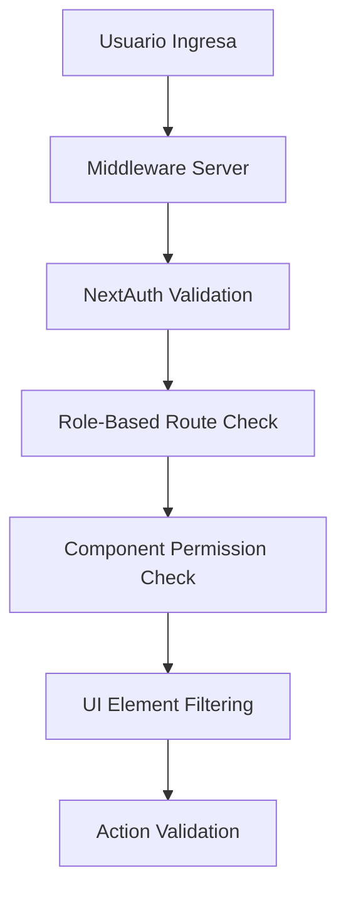

# 🔐 Sistema de Control de Acceso por Roles

## ✅ Implementación Completada

Se ha implementado exitosamente un **sistema de control de acceso basado en roles** que restringe el acceso del usuario secretario según los requerimientos especificados.

## 🎯 Configuración de Permisos por Rol

### 👤 **Secretario** (Tu requerimiento específico)
```typescript
'secretario': {
  canViewDashboard: true,          // ✅ Dashboard
  canViewPersonas: true,           // ✅ Ver personas
  canManagePersonas: false,        // ❌ NO puede editar personas
  canViewUsuarios: false,          // ❌ NO acceso a usuarios
  canManageUsuarios: false,        // ❌ NO gestión usuarios
  canViewSacramentos: true,        // ✅ Ver sacramentos
  canManageSacramentos: false,     // ❌ NO puede editarlos
  canViewConstancias: true,        // ✅ Ver constancias
  canGenerateConstancias: true,    // ✅ SÍ puede generar
  canViewReportes: false,          // ❌ NO acceso reportes
  canViewConfiguracion: false,     // ❌ NO acceso configuración
}
```

### 🔧 **Otros Roles Disponibles**

#### 🛡️ **Administrador** - Acceso Total
- ✅ Todas las funcionalidades disponibles

#### ⛪ **Párroco** - Casi Total
- ✅ Acceso a todo excepto gestión completa de usuarios
- ✅ Puede ver configuración pero no editarla completamente

#### 👨‍💼 **Vicario** - Gestión Operativa
- ✅ Personas, sacramentos, constancias, reportes
- ❌ Sin usuarios ni configuración

#### 🕊️ **Sacerdote/Diácono** - Pastoral
- ✅ Personas, sacramentos, constancias
- ❌ Sin usuarios, reportes, configuración

## 🛡️ Componentes de Seguridad Implementados

### 1. **Hook de Permisos** (`usePermissions.ts`)
- Verifica permisos por rol dinámicamente
- Provee funciones de validación granular
- Integración con NextAuth para roles de usuario

### 2. **Navegación Inteligente** (`navigation.ts`)
- Filtra automáticamente opciones del menú
- Solo muestra elementos accesibles al rol actual
- Configuración centralizada de permisos

### 3. **Protección de Rutas** (`ProtectedRoute.tsx`)
- Componente HOC para proteger páginas
- Redirección automática sin permisos
- Mensajes de error personalizados

### 4. **Middleware de Servidor** (`middleware.ts`)
- Protección a nivel de servidor
- Redirección automática por roles
- Validación antes de cargar páginas

### 5. **Componentes de UI** (`ReadOnlyNotice.tsx`)
- Avisos de solo lectura para secretarios
- Botones deshabilitados con tooltips explicativos
- Feedback visual de permisos limitados

## 🚀 **Funcionalidades por Rol: Secretario**

### ✅ **Permitido**
1. **Dashboard** - Vista general del sistema
2. **Personas** - Solo lectura, no puede crear/editar
3. **Sacramentos** - Solo lectura:
   - Bautismos (consultar únicamente)
   - Primera Comunión (consultar únicamente)  
   - Confirmaciones (consultar únicamente)
   - Matrimonios (consultar únicamente)
4. **Constancias** - Puede generar y descargar

### ❌ **Restringido**
1. **Usuarios** - Sin acceso completamente
2. **Reportes** - Sin acceso
3. **Configuración** - Sin acceso  
4. **Edición de Sacramentos** - No puede crear/modificar
5. **Edición de Personas** - No puede crear/modificar

## 🔒 **Seguridad Multi-Capa**



### **Capa 1**: Middleware de Servidor
- Bloquea rutas no autorizadas antes de cargar
- Redirección automática al dashboard

### **Capa 2**: Protección de Componentes
- `ProtectedRoute` valida permisos específicos
- Muestra mensajes de acceso denegado

### **Capa 3**: UI Responsiva
- Menús filtrados por permisos
- Botones deshabilitados según rol
- Avisos de solo lectura

### **Capa 4**: Validación de Acciones
- APIs verifican permisos antes de ejecutar
- Feedback inmediato de restricciones

## 🧪 **Cómo Probar**

1. **Login como Secretario** en el sistema
2. **Verifica el Sidebar** - Solo verás opciones permitidas:
   - Dashboard ✅
   - Personas ✅ 
   - Sacramentos ✅
   - Constancias ✅
   - ❌ NO verás: Usuarios, Reportes, Configuración

3. **Intenta acceder manualmente** a rutas restringidas:
   - `/usuarios` → Redirige a dashboard
   - `/reportes` → Redirige a dashboard  
   - `/configuracion` → Redirige a dashboard

4. **En páginas permitidas**:
   - Sacramentos: Solo lectura, sin botones de editar/crear
   - Personas: Solo lectura, sin botones de editar/crear
   - Constancias: Botones de generar habilitados

## 🌟 **Estado del Sistema**

- **Servidor**: 🟢 Corriendo en http://localhost:3001
- **Autenticación**: 🔐 NextAuth con roles integrados  
- **Permisos**: ✅ Sistema granular implementado
- **Navegación**: 🧭 Filtrada dinámicamente
- **Seguridad**: 🛡️ Multi-capa funcionando

---

**¡El sistema de control de acceso está completamente funcional!** 🎊

El usuario secretario ahora tiene exactamente los permisos que solicitaste:
- ✅ Acceso solo a registros de sacramentos (lectura)
- ✅ Generación de constancias  
- ❌ Sin acceso a configuración, reportes, usuarios
- ❌ Sin capacidad de editar sacramentos
