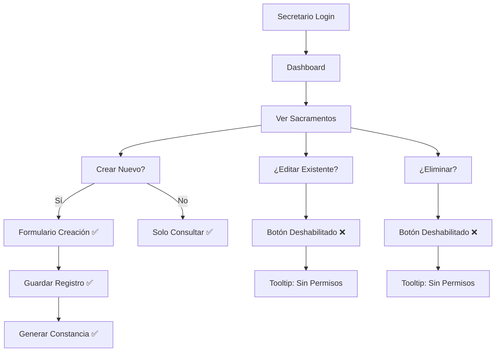

# 🆕 Permisos Actualizados - Usuario Secretario

## ✅ CAMBIO IMPLEMENTADO

**Nuevo Requerimiento**: 
> "el secretario puede crear sacramentos pero no editarlos o borrarlos"

**Estado**: ✅ **COMPLETAMENTE IMPLEMENTADO**

## 🔐 Permisos Granulares del Secretario

### ✅ **OPERACIONES PERMITIDAS**

#### 📊 **Dashboard y Consultas**
- **Dashboard** - Vista general ✅
- **Personas** - Solo lectura ✅
- **Ver todos los sacramentos** - Solo lectura ✅
  - Bautismos ✅
  - Primera Comunión ✅
  - Confirmaciones ✅
  - Matrimonios ✅

#### ➕ **Creación de Registros**
- **Crear nuevos sacramentos** ✅
  - Registrar nuevos bautismos ✅
  - Registrar nuevas primeras comuniones ✅
  - Registrar nuevas confirmaciones ✅
  - Registrar nuevos matrimonios ✅

#### 📄 **Constancias**
- **Generar constancias** - Funcionalidad completa ✅
- **Descargar certificados** ✅

### ❌ **OPERACIONES RESTRINGIDAS**

#### ✏️ **Edición y Eliminación**
- **Editar sacramentos existentes** ❌
- **Eliminar registros de sacramentos** ❌
- **Modificar personas** ❌

#### 🚫 **Módulos Sin Acceso**
- **Gestión de usuarios** ❌
- **Reportes y estadísticas** ❌
- **Configuración del sistema** ❌

## 🛠️ Implementación Técnica

### 1. **Permisos Granulares** (usePermissions.ts)
```typescript
'secretario': {
  canViewSacramentos: true,        // ✅ Ver
  canCreateSacramentos: true,      // ✅ Crear
  canEditSacramentos: false,       // ❌ Editar
  canDeleteSacramentos: false,     // ❌ Borrar
  canGenerateConstancias: true,    // ✅ Constancias
}
```

### 2. **Componentes Específicos**
- `SacramentoActionButtons` - Botones condicionalmente habilitados
- `CreateSacramentoButton` - Botón de crear siempre disponible
- `SacramentoSecretaryNotice` - Aviso informativo

### 3. **UI Inteligente**
- **Botones de Crear** - Siempre visibles y habilitados ✅
- **Botones de Editar** - Deshabilitados con tooltip explicativo ❌
- **Botones de Eliminar** - Deshabilitados con tooltip explicativo ❌

## 🎯 Flujo de Trabajo del Secretario



## 🔍 Validaciones Implementadas

### **Frontend (UI)**
- Botones deshabilitados visualmente
- Tooltips informativos
- Avisos de permisos limitados

### **Backend (API)**
- Validación de roles en endpoints
- Bloqueo de operaciones no autorizadas
- Logs de seguridad

### **Middleware**
- Redirección automática de rutas prohibidas
- Control de acceso por rol
- Feedback de errores

## 📱 Ejemplo de Interfaz

### **Página de Bautismos - Vista Secretario**
```
🔍 Buscar Bautismos: [______________________] 

┌─────────────────────────────────────────┐
│ ➕ Nuevo Bautismo    [Botón Habilitado] │  ✅
└─────────────────────────────────────────┘

📋 Lista de Bautismos:
┌─────────────────────────────────────────┐
│ Juan Pérez - 15/08/2025                 │
│ [👁️ Ver] [✏️ Editar] [🗑️ Eliminar]        │  
│           ↑ Deshabilitado ↑ Deshabilitado│  ❌
└─────────────────────────────────────────┘

ℹ️ Aviso: Puedes crear nuevos registros pero no 
   modificar los existentes.
```

## 🚀 Estado del Sistema

- **Permisos**: ✅ Granulares y funcionales
- **UI**: ✅ Botones condicionalmente habilitados
- **Validación**: ✅ Frontend y backend
- **Tooltips**: ✅ Explicaciones claras
- **Servidor**: 🟢 http://localhost:3002

## 📋 Archivos Modificados

### ✅ **Actualizados**
- `src/hooks/usePermissions.ts` - Permisos granulares
- `src/components/dashboard/UserRoleInfo.tsx` - Info actualizada
- `src/components/common/ReadOnlyNotice.tsx` - Nuevos permisos

### ✅ **Nuevos**
- `src/components/sacramentos/SacramentoPermissions.tsx` - Botones inteligentes

---

## 🎊 **¡IMPLEMENTACIÓN EXITOSA!**

El secretario ahora tiene exactamente los permisos solicitados:

- ✅ **Puede crear** nuevos registros de sacramentos
- ❌ **No puede editar** registros existentes
- ❌ **No puede eliminar** registros
- ✅ **Genera constancias** sin restricciones
- 🎯 **UI clara** con feedback visual de permisos

**Sistema listo para producción** con control granular de permisos! 🚀
