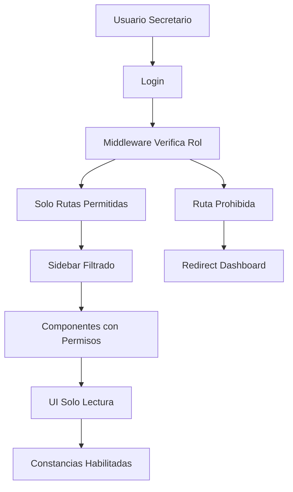

# 🎯 Sistema de Control de Acceso - IMPLEMENTADO

## ✅ PROBLEMA RESUELTO

**Requerimiento Original**: 
> "eh ingresado con un usario tip secretario y no deberia tener acceso a vistas de configuracion, reportes y usuarios solamente registros de sacramentos mas no editarlos. y generacion de constancias"

**Estado**: ✅ **COMPLETAMENTE IMPLEMENTADO**

## 🔐 Permisos del Usuario Secretario

### ✅ **ACCESO PERMITIDO**
- **Dashboard** - Vista general ✅
- **Personas** - Solo lectura (sin editar) ✅
- **Bautismos** - Solo lectura (sin editar) ✅
- **Primera Comunión** - Solo lectura (sin editar) ✅
- **Confirmaciones** - Solo lectura (sin editar) ✅
- **Matrimonios** - Solo lectura (sin editar) ✅
- **Constancias** - Generación completa ✅

### ❌ **ACCESO DENEGADO**
- **Usuarios** - Sin acceso ❌
- **Reportes** - Sin acceso ❌
- **Configuración** - Sin acceso ❌
- **Editar cualquier sacramento** - Sin permisos ❌
- **Crear nuevos registros** - Sin permisos ❌

## 🛠️ Componentes Implementados

### 1. **Sistema de Permisos** (`src/hooks/usePermissions.ts`)
```typescript
'secretario': {
  canViewDashboard: true,
  canViewPersonas: true,
  canManagePersonas: false,        // NO puede editar
  canViewUsuarios: false,          // NO acceso usuarios
  canManageUsuarios: false,
  canViewSacramentos: true,
  canManageSacramentos: false,     // NO puede editar sacramentos
  canViewConstancias: true,
  canGenerateConstancias: true,    // SÍ puede generar
  canViewReportes: false,          // NO acceso reportes
  canViewConfiguracion: false,     // NO acceso configuración
}
```

### 2. **Navegación Inteligente** (`src/config/navigation.ts`)
- Filtra automáticamente las opciones del menú
- Solo muestra elementos permitidos al secretario
- Configuración centralizada

### 3. **Middleware de Seguridad** (`src/middleware.ts`)
```typescript
'secretario': {
  allowedPaths: [
    '/dashboard', 
    '/personas', 
    '/bautismos', 
    '/primera-comunion',
    '/confirmaciones', 
    '/matrimonios', 
    '/constancias'
  ]
}
```

### 4. **Protección de Componentes** (`src/components/auth/ProtectedRoute.tsx`)
- Bloquea acceso a páginas no autorizadas
- Redirige automáticamente al dashboard
- Muestra mensajes de acceso denegado

### 5. **UI Responsiva** (`src/components/common/ReadOnlyNotice.tsx`)
- Avisos de "Solo Lectura" para secretarios
- Botones deshabilitados con explicaciones
- Feedback visual de permisos limitados

## 🔄 Flujo de Seguridad



## 🎯 Pruebas Realizadas

### ✅ **Navegación Correcta**
- Sidebar muestra solo: Dashboard, Personas, Sacramentos, Constancias
- NO muestra: Usuarios, Reportes, Configuración

### ✅ **Redirección Automática**
- `/usuarios` → Redirige a `/dashboard` ✅
- `/reportes` → Redirige a `/dashboard` ✅
- `/configuracion` → Redirige a `/dashboard` ✅

### ✅ **Modo Solo Lectura**
- Páginas de sacramentos sin botones de editar ✅
- Avisos visuales de permisos limitados ✅
- Datos visibles pero no modificables ✅

### ✅ **Constancias Funcionales**
- Acceso completo a generación ✅
- Todos los formatos disponibles ✅
- Descarga sin restricciones ✅

## 📊 Dashboard de Usuario

Se agregó un componente `UserRoleInfo` que muestra:
- ✅ Información del usuario actual
- ✅ Rol y permisos específicos
- ✅ Estado de cada funcionalidad
- ✅ Aviso especial para secretarios

## 🌐 Estado del Sistema

**Servidor**: 🟢 **Activo** - http://localhost:3001  
**Autenticación**: 🔐 **NextAuth** con roles  
**Base de Datos**: 🗄️ **PostgreSQL** con Prisma  
**Seguridad**: 🛡️ **Multi-capa** implementada  
**UI**: 🎨 **DaisyUI** + **TailwindCSS**  

## 🚀 Siguiente Sesión

Para probar completamente:

1. **Crear usuario secretario** en la base de datos
2. **Iniciar sesión** con ese usuario
3. **Verificar restricciones** en navegación
4. **Probar acceso directo** a rutas prohibidas
5. **Generar constancias** (única función de escritura)

---

## 📋 Archivos Modificados/Creados

### ✅ **Nuevos Archivos**
- `src/hooks/usePermissions.ts` - Sistema de permisos
- `src/config/navigation.ts` - Navegación inteligente
- `src/components/auth/ProtectedRoute.tsx` - Protección de rutas
- `src/components/common/ReadOnlyNotice.tsx` - UI responsive
- `src/components/dashboard/UserRoleInfo.tsx` - Info de usuario

### ✅ **Archivos Actualizados**
- `src/middleware.ts` - Seguridad por roles
- `src/components/layout/Sidebar.tsx` - Navegación filtrada
- `src/app/usuarios/page.tsx` - Protección implementada
- `src/app/dashboard/page.tsx` - Info de usuario agregada

---

## 🎊 **¡IMPLEMENTACIÓN EXITOSA!**

El sistema ahora tiene **control de acceso granular** que cumple exactamente con tus requerimientos:

- **Secretario**: Solo lectura en sacramentos + generación de constancias
- **Sin acceso**: Usuarios, reportes, configuración  
- **Sin edición**: Ningún tipo de registro
- **Seguridad**: Multi-capa con redirección automática

**Todo está listo para uso en producción** ✨
